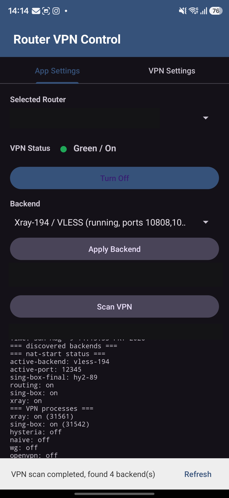
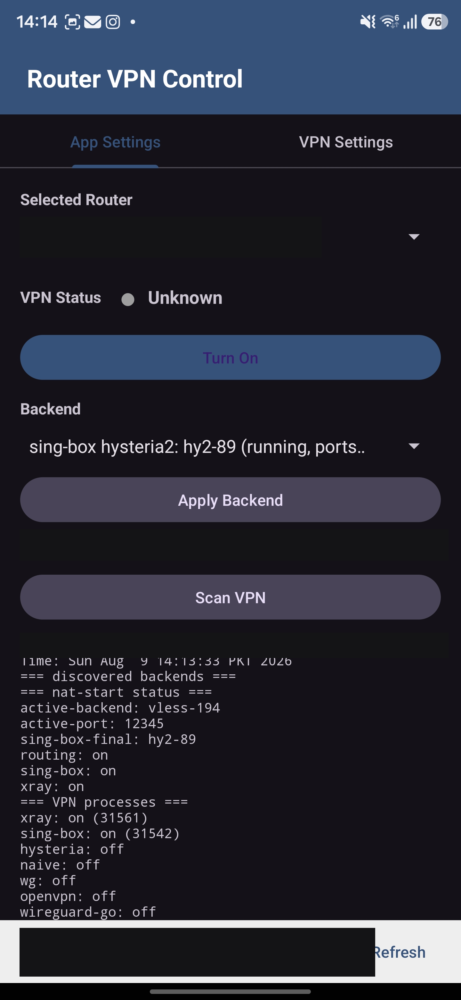
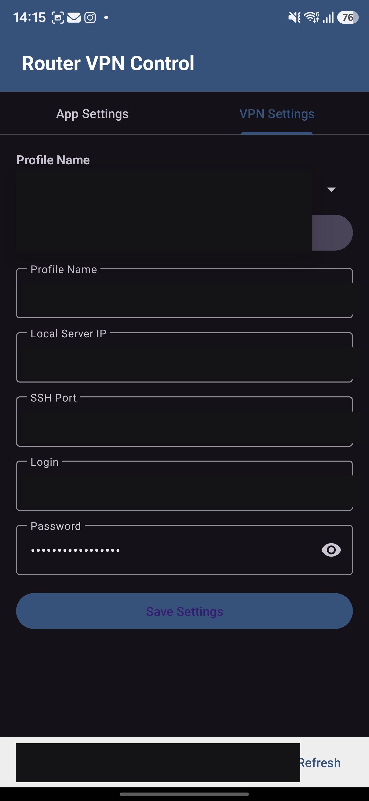

# Router VPN Control (Android)

Android-приложение для управления VPN-профилями на домашних роутерах через SSH. Это порт Windows-версии Router VPN Control: та же логика работы с роутером, те же управляющие скрипты, но в виде мобильного приложения.

Протестировано на прошивках:

- **ASUS-Merlin** — через `/jffs/scripts/nat-start`;
- **OpenWrt** — через init/service/systemctl и `sing-box` outbounds.

## Скриншоты

| Управление | Выбор backend | Настройки роутера |
| --- | --- | --- |
|  |  |  |

Адреса, имена роутеров и учётные данные на скриншотах закрашены.

## Возможности

- несколько профилей роутеров (имя, IP/host, SSH-порт, логин, пароль);
- пароли шифруются через Android Keystore (AES/GCM) — аналог Windows DPAPI;
- выбор активного роутера;
- сканирование VPN-сервисов и доступных VPN-профилей (`Scan VPN`);
- включение и отключение VPN routing (`Turn On` / `Turn Off`);
- переключение backend-профилей (`Apply Backend`), включая отдельные proxy outbounds внутри `sing-box`;
- фильтрация технических `sing-box` inbounds/listeners (`mixed`, `redirect`, `tun`, `tproxy`), чтобы в списке оставались только реальные VPN-профили.

Отличия от Windows-версии: нет tray-иконки и автозапуска — на Android они неприменимы.

## Установка

Готовый APK лежит в [Releases](../../releases). Приложение подписано собственным ключом, поэтому при установке Android попросит разрешить установку из неизвестных источников.

Минимальная версия — Android 8.0 (API 26).

## Как пользоваться

1. Откройте вкладку `VPN Settings` (при первом запуске приложение открывает её само) и заполните профиль роутера: имя, IP/host, SSH-порт, логин, пароль. Нажмите `Save Settings`.
2. Перейдите на `App Settings` и нажмите `Scan VPN`.
3. Выберите найденный `Backend`.
4. Используйте `Apply Backend`, `Turn On` и `Turn Off`.

Поле с адресом можно заполнять как удобно — `192.168.1.1`, `192.168.1.1:2222`, `ssh://root@host:2222/`. Схема, путь и имя пользователя отбрасываются, порт из адреса подставляется в поле `SSH Port`.

## Логика работы с роутером

Для ASUS-Merlin приложение ожидает управляющий скрипт:

```sh
/jffs/scripts/nat-start
```

Доступные команды определяются по `use-*`, например:

```sh
/jffs/scripts/nat-start use-hy2-89
/jffs/scripts/nat-start use-vless-194
```

Для OpenWrt приложение сканирует доступные VPN-сервисы и конфиги. Для `sing-box` показываются только proxy `outbounds`.

Все скрипты, выполняемые на роутере, лежат в открытом виде в `app/src/main/assets/scripts/` — их можно прочитать перед установкой.

## Сборка

Нужны JDK 17 и Android SDK (platform 34, build-tools 34.0.0).

Debug-сборка:

```powershell
gradle assembleDebug
```

Release-сборка требует файл `keystore.properties` в корне проекта (он намеренно не хранится в репозитории):

```properties
storeFile=C:\\path\\to\\your.jks
storePassword=...
keyAlias=...
keyPassword=...
```

```powershell
gradle assembleRelease
```

Готовый APK: `app/build/outputs/apk/release/app-release.apk`.

## Безопасность

- Пароли роутеров хранятся только на устройстве: они зашифрованы ключом из Android Keystore и лежат в приватном каталоге приложения. Наружу ничего не отправляется.
- Приложению нужны только `INTERNET` и `ACCESS_NETWORK_STATE`.
- Ключ хоста SSH не проверяется — приложение рассчитано на подключение к своему роутеру в доверенной сети. Для подключения через публичный адрес это стоит учитывать.
- Не публикуйте свои скриншоты, конфиги и логи со скана: в них видны адреса роутера, открытые порты и имена сервисов.

## Стек

- Kotlin, Android Views + Material 3
- SSH: [sshj](https://github.com/hierynomus/sshj) + BouncyCastle + EdDSA
- Настройки: JSON (Gson) в приватном каталоге приложения

## Лицензия

[MIT](LICENSE)
